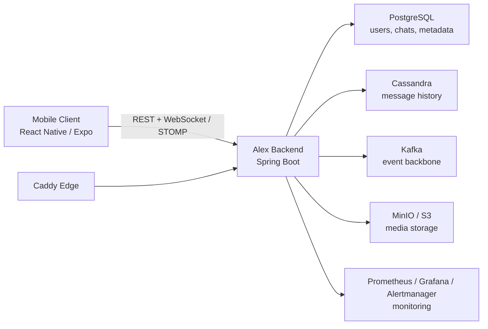

# Alex

> Alex позиционируется как первый суверенный белорусский мессенджер нового поколения.
>
> Это не просто чат-клиент, а полноценная коммуникационная платформа со своим backend, мобильным приложением, real-time слоем, медиахранилищем, эксплуатационным контуром и заделом под масштабирование, бизнес-сценарии и национальную инфраструктуру.

## Что такое Alex

Alex создаётся как мобильный белорусский мессенджер, который можно разворачивать и развивать внутри собственного инфраструктурного контура без зависимости от чужого messaging backend. Проект уже давно вышел за рамки первоначального MVP: в репозитории есть не только личные переписки, но и группы, каналы, темы, папки, глобальный поиск, звонки, stories, боты, mini apps, секретные чаты, push-уведомления, управление сессиями, экспорт аккаунта, feature flags, наблюдаемость и production-ready deployment contour.

Под суверенностью в Alex понимается контроль над критическим ядром продукта:

- собственный backend на `Spring Boot`
- собственная модель хранения и маршрутизации сообщений
- собственный real-time слой на `WebSocket/STOMP`
- собственный data stack на `PostgreSQL`, `Cassandra`, `Kafka` и `MinIO`
- собственный deploy-контур с `Caddy`, `Prometheus`, `Grafana`, `Alertmanager`, backup/restore и CI/CD

Именно поэтому Alex можно описывать не как "ещё один мессенджер", а как основу для белорусской коммуникационной платформы полного цикла.

## Почему Alex выделяется

- `Суверенный серверный контур.` Ядро продукта контролируется проектом: API, real-time доставка, базы данных, event bus, media storage, edge routing и эксплуатация разворачиваются в собственной инфраструктуре.
- `Не узкий MVP, а широкая продуктовая платформа.` В кодовой базе уже есть чаты, каналы, звонки, stories, боты, mini apps, секретные чаты, бизнес-функции, платежные и premium-модули, а также монетизационный слой для каналов.
- `Mobile-first подход.` У проекта есть реальный клиент на `React Native / Expo` с экранной моделью, офлайн-кэшем, outbox-паттерном, синхронизацией и поддержкой push-уведомлений.
- `Инженерная зрелость.` Alex описывает не только продуктовые фичи, но и путь в production: CI, Docker Compose для local/deploy, image pipeline, remote deploy, monitoring, health checks и backup/restore.
- `Безопасность и управляемость.` В платформе уже реализованы `JWT`, refresh token flow, 2FA, passkeys, QR login, управление сессиями, case-based compliance workflow и device-side криптография для secret chats.
- `Поэтапный rollout.` Расширенные модули управляются через feature flags, что позволяет безопасно включать новый функционал без форка кодовой базы.

## Основные возможности

- `Авторизация и идентификация.` Запрос и подтверждение login-кода, refresh token flow, 2FA, passkeys, QR login, смена номера, security events и управление активными сессиями.
- `Базовые коммуникации.` Direct chats, группы, каналы, Saved Messages, архив, папки, публичные username, join-by-link, join-by-username, join requests и модерация участников.
- `Сообщения.` Текстовые сообщения, вложения, редактирование и удаление, пересылка, реакции, опросы, live location, scheduled messages, repeating messages, send-when-online и поиск по истории.
- `Контент и discovery.` Глобальный поиск, поиск публичных чатов, темы в форумах, shared media, pinned messages, draft-сообщения и импорт контактов.
- `Звонки.` RTC-конфиг, история звонков, активные вызовы, call join links, групповые звонки, комментарии, реакции, hand raise, screen sharing, moderation и recording surface.
- `Stories.` Лента, архив, highlights, albums, viewers, реакции, replies, mentions, reshares и live-режим.
- `Боты и mini apps.` Каталог ботов, команды, inline results, message actions, bot web apps, developer bot cabinet, rotation токенов, webhooks и подготовка к bot payments.
- `Secret chats.` Отдельный приватный контур с device-side криптографией, локальным хранением ключей, таймерами удаления, защищёнными вложениями и screenshot events.
- `Аккаунт и приватность.` Экспорт аккаунта, отложенное удаление, управление фото профиля, privacy settings, block/report flows и языковые настройки.
- `Business и platform-модули.` Быстрые ответы, теги чатов, назначение операторов, payments, premium, monetization, translations и compliance/export workflow уже присутствуют в кодовой базе и готовы к поэтапному включению через флаги.

## В чём уникальность Alex для рынка РБ

На белорусском рынке редко встречается сочетание сразу четырёх качеств в одном проекте:

- `локальная идентичность продукта`
- `собственный серверный и инфраструктурный контур`
- `массовый consumer-сценарий, а не только закрытый корпоративный периметр`
- `реальная инженерная готовность к эксплуатации, а не только презентационный прототип`

В отличие от решений, которые либо ориентированы на узкий государственный или корпоративный контур, либо завязаны на внешние платформы, Alex строится как собственная коммуникационная экосистема. Здесь есть не только переписка, но и продуктовая глубина: чаты, звонки, stories, боты, mini apps, офлайн-режим, администрирование, наблюдаемость, бэкапы и масштабируемая архитектура данных.

Именно это делает Alex сильным кандидатом на роль первого по-настоящему суверенного белорусского мессенджера нового поколения.

## Архитектура платформы



Архитектурно Alex опирается на разделение ролей:

- `React Native / Expo` отвечает за мобильный UX, локальное состояние, offline cache, outbox и device capabilities.
- `Spring Boot` закрывает API, безопасность, бизнес-логику, real-time доставку, feature flags и product orchestration.
- `PostgreSQL` хранит строго согласованные сущности: пользователи, чаты, ключи, профили, метаданные.
- `Cassandra` забирает на себя историю сообщений и высоконагруженный append-heavy контур.
- `Kafka` выступает как событийная шина для delivery, fanout, синхронизации, расширения платформы и фоновых процессов.
- `MinIO` даёт собственное S3-совместимое медиахранилище.

## Технологический стек

| Слой | Технологии | Роль |
| --- | --- | --- |
| Mobile | `React Native`, `Expo`, `TypeScript`, `Zustand`, `React Navigation` | Кроссплатформенный клиент, мобильный UX и локальное состояние |
| Real-time | `WebSocket`, `STOMP`, `react-native-webrtc` | Доставка событий, чаты и звонки |
| Offline layer | `expo-sqlite`, `expo-secure-store` | Кэш чатов, outbox, sync cursor, локальные ключи |
| Security | `JWT`, refresh tokens, `2FA`, passkeys, QR login, `tweetnacl` | Идентификация, защита аккаунта и secret chats |
| Backend | `Java 17`, `Spring Boot 3.5`, `Spring Security`, `Spring WebSocket`, `Spring Data JPA`, `Spring Kafka`, `Flyway` | API, бизнес-логика, real-time, миграции и event-driven flow |
| Data | `PostgreSQL`, `Cassandra` | Транзакционные данные и история сообщений |
| Media | `MinIO` | S3-совместимое хранение файлов и медиаконтента |
| Infra | `Docker Compose`, `Caddy`, `Prometheus`, `Grafana`, `Alertmanager` | Локальный запуск, production edge, мониторинг и алертинг |
| CI/CD | `GitHub Actions`, `GHCR` | CI, image build/publish, remote deploy и backup workflows |
| Testing | `JUnit`, `Spring Boot Test`, `Testcontainers`, `Jest`, `@testing-library/react-native` | Unit, integration и UI-level regression checks |

## Что особенно важно с инженерной точки зрения

- `Feature flags.` В backend уже есть флаги для `stories`, `bots`, `calls`, `secret chats`, `admin compliance`, `group calls`, `story interactions`, а также задел под `business`, `payments`, `premium`, `monetization` и `translations`.
- `Offline resilience.` Мобильный клиент использует локальную `SQLite` базу, хранит кэш чатов и сообщений, поддерживает outbox и синхронизацию событий через `/api/sync/events`.
- `Нормальная эксплуатация.` В репозитории уже есть health checks, `Prometheus` metrics, `Grafana` dashboard, `Alertmanager`, deploy scripts и volume-level backup/restore.
- `Проработанный auth stack.` Это не один login endpoint: есть OTP flow, refresh tokens, passkeys, QR login, смена номера и управление устройствами.
- `Готовность к расширению.` Боты, mini apps, бизнес-профили, платежи, premium и монетизация встроены как модули платформы, а не как внешняя надстройка.

## Структура репозитория

```text
.
|-- backend/     # Spring Boot backend, API, бизнес-логика, real-time, data model
|-- frontend/    # React Native / Expo mobile client
|-- infra/       # Caddy, Prometheus, Grafana, Alertmanager, scripts, init files
|-- docker-compose.yml
|-- docker-compose.deploy.yml
|-- ARCHITECTURE.md
|-- DEPLOYMENT.md
|-- LOCAL_SETUP.md
`-- smoke-test.ps1
```

## Быстрый старт

Актуальная документация по запуску и эксплуатации:

- [LOCAL_SETUP.md](LOCAL_SETUP.md) — локальный Windows bootstrap и smoke flow
- [ARCHITECTURE.md](ARCHITECTURE.md) — архитектурные решения и масштабирование
- [DEPLOYMENT.md](DEPLOYMENT.md) — deploy-контур, мониторинг и backup/restore

Минимальный локальный запуск:

```powershell
docker compose up -d postgres cassandra cassandra-init minio minio-init zookeeper kafka

cd backend
.\mvnw.cmd spring-boot:run

cd ..\frontend
npm install
npm start
```

Для проверки локального контура:

```powershell
powershell -ExecutionPolicy Bypass -File .\smoke-test.ps1
```

## Тестирование и CI/CD

- `Frontend:` `npm run typecheck` и `npm test`
- `Backend:` `mvn test`
- `Integration:` `mvn -P integration-tests verify`
- `CI:` в GitHub Actions валидируются compose-контуры, гоняются backend/frontend тесты и отдельно проверяется backend image smoke
- `CD:` предусмотрены workflows для публикации backend image в `GHCR`, remote deploy и remote backup

## Статус проекта

Alex уже не выглядит как "просто MVP". Репозиторий содержит полноценный фундамент мессенджера национального уровня: consumer core, real-time инфраструктуру, мобильный клиент, data stack, observability, deploy contour и платформенные расширения для дальнейшего роста. Это сильная база для продукта, который может развиваться и как массовый белорусский мессенджер, и как коммуникационная платформа для бизнеса, медиа, сообществ и сервисов.
